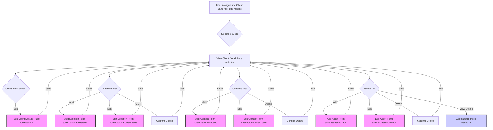

# Client Details Enhancement Plan

## 1. Goal

Enhance the IronMonkey Risk Research Platform to allow users to add and manage detailed information for *existing* clients after initial onboarding. This includes:
*   Multiple locations with geographic coordinates (latitude/longitude).
*   Client competitors.
*   Multiple contacts.
*   Multiple assets (linking to locations where applicable).
*   Editing core client details.

This enhancement aims to capture the necessary data points outlined in the Geopolitical Cyber Risk Assessment Framework (`docs/framework.md`), particularly under "Phase 3: Organizational Exposure".

## 2. Analysis Summary

*   **Current State:** The platform supports onboarding new clients with basic details, one primary contact, and one primary location. A client detail page exists but lacks functionality to display or manage related entities (locations, contacts, assets) or edit core client info.
*   **Models:** The database models (`Client`, `ClientLocation`, `ClientContact`, `ClientAsset`) already support one-to-many relationships for locations, contacts, and assets. The `ClientLocation` model includes `latitude` and `longitude`.
*   **Gaps:**
    *   No UI or backend routes exist to add/edit/delete multiple locations, contacts, or assets for an existing client.
    *   No UI or backend route exists to edit the core details of an existing client.
    *   The `Client` model lacks a field to store `competitors`.
    *   The exact implementation and location of the `/assets` routes used by existing templates are currently unknown, but we will plan for their integration into the client detail view.

## 3. Proposed Workflow

The primary interaction point will be the enhanced `Client Detail` page (`/clients/<client_id>`).

**Workflow Steps:**

1.  **Access:** User views the `Client Detail` page.
2.  **Display:** The page shows:
    *   Core client info (Name, Industry, Description, Website, Public Profile, **Competitors**) with an "Edit Details" button.
    *   A list of associated **Locations** (Name, Address, Type) with "Add Location", "Edit", and "Delete" options.
    *   A list of associated **Contacts** (Name, Email, Position) with "Add Contact", "Edit", and "Delete" options.
    *   A list of associated **Assets** (Name, Type, Criticality) with "Add Asset", "Edit", "Delete", and "View Details" options.
3.  **Actions:**
    *   Clicking "Edit Details" leads to a form to modify core client info (including competitors).
    *   Clicking "Add Location/Contact/Asset" leads to dedicated forms for creating new related items.
    *   Clicking "Edit" on a list item leads to a form pre-filled with that item's data.
    *   Clicking "Delete" prompts for confirmation before removing the item.
    *   Clicking "View Details" for an asset links to its dedicated detail page (e.g., `/assets/<asset_id>`).

## 4. Required Changes

*   **Models (`app/models/client.py`):**
    *   Add `competitors = db.Column(JSONB)` to the `Client` model. (Requires DB migration).
*   **Forms (`app/blueprints/client/forms.py`):**
    *   Create `ClientEditForm`: Contains fields from `Client` model (Name, Industry, Website, Description, Public Profile, Competitors). Competitors could be a `TextAreaField` expecting JSON or comma-separated values, or handled with JavaScript for a better UX.
    *   Create `LocationForm`: Fields for `ClientLocation` (Name, Address, City, State, Country, Postal Code, Type, Latitude, Longitude).
    *   Create `ContactForm`: Fields for `ClientContact` (First Name, Last Name, Email, Phone, Position, Notes, Is Primary).
    *   Create `AssetForm`: Fields for `ClientAsset` (Name, Type, Description, Criticality, Location ID [dropdown], Technical Details [TextArea]).
*   **Routes (`app/blueprints/client/routes.py`):**
    *   Implement routes for CRUD (Create, Read, Update, Delete) operations for Locations, Contacts, and Assets, scoped under `/clients/<client_id>/`. Examples:
        *   `/clients/<client_id>/edit` (GET, POST)
        *   `/clients/<client_id>/locations/add` (GET, POST)
        *   `/clients/<client_id>/locations/<location_id>/edit` (GET, POST)
        *   `/clients/<client_id>/locations/<location_id>/delete` (POST/DELETE)
        *   *(Similar patterns for contacts and assets)*
    *   Modify the existing `client_detail` route (`/clients/<client_id>`) to query and pass the lists of `locations`, `contacts`, and `assets` to its template.
*   **Templates:**
    *   Enhance `app/templates/client/client_detail.html`: Add sections using loops to display lists of locations, contacts, and assets. Include buttons/links triggering the new CRUD routes. Display the `competitors` field.
    *   Create new templates for the forms: `edit_client.html`, `location_form.html`, `contact_form.html`, `asset_form.html`. These will render the corresponding WTForms.
*   **Services (`app/services/client_service.py`):**
    *   Add/modify service functions to handle updating client details, and the CRUD operations for locations, contacts, and assets, interacting with the database.
*   **Database:**
    *   Generate and apply a database migration (using Flask-Migrate/Alembic) to add the `competitors` column to the `clients_organizations` table.

## 5. Next Steps

Proceed with implementation in 'code' mode.