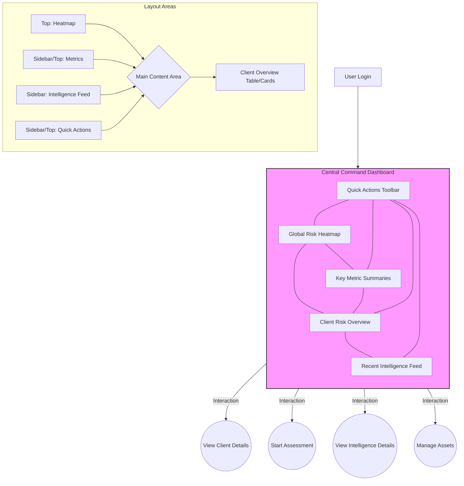

# IronMonkey Central Command Dashboard - Landing Page Plan

## 1. Overview

The goal of this landing page is to provide users with an immediate, actionable overview of the geopolitical cyber risk landscape relevant to their scope (e.g., their clients, their organization's assets) and quick access to key platform functions upon login.

## 2. Proposed Sections/Widgets

### 2.1 Global Risk Heatmap (Top Section)

- **Content:** An interactive world map visualizing key geopolitical hotspots (conflicts, tensions) and potentially overlaying high-level cyber threat activity relevant to monitored industries or client locations. Could use color-coding based on severity derived from the framework's principles.
- **Rationale:** Directly addresses the core purpose of the platform (geopolitical cyber risk) and leverages the planned "Geospatial Mapping" capability. Provides an immediate visual summary. (Connects to `framework.md` Sections 1 & 2, `platform_plan.md` Section 2.4).
- **Interaction:** Clicking on regions could filter other dashboard elements or link to detailed intelligence reports for that area.

### 2.2 Key Metric Summaries (Below Map or Sidebar)

- **Content:** Cards displaying key numbers:
  - Total Clients Managed
  - Active Risk Assessments
  - High-Priority Open Findings
  - New Critical Intelligence Alerts (last 24/48h)
  - Assets Under Monitoring
- **Rationale:** Provides a quick quantitative overview of the current status and workload. Uses data from Client Management, Risk Assessment (future), and Intelligence Feed (future). (Connects to `platform_plan.md` Sections 2.1, 2.2, 2.3).
- **Interaction:** Clicking a metric could link to the relevant detailed list page (e.g., clicking "Total Clients" goes to the client list).

### 2.3 Client Risk Overview (Main Section)

- **Content:** A sortable/filterable table or card list showing:
  - Client Name
  - Overall Risk Score (placeholder/simplified initially, detailed later)
  - Industry
  - Key Regions of Operation/Exposure
  - Date of Last Assessment
  - Quick Actions (View Profile, Start Assessment)
- **Rationale:** Focuses on the currently implemented/in-progress Client Management features. Allows users to quickly identify high-risk clients or those needing attention. (Connects to `platform_plan.md` Section 2.1, `framework.md` Section 3).

### 2.4 Recent Intelligence Feed (Sidebar or Main Section)

- **Content:** A scrolling list of the latest relevant intelligence items (geopolitical events, major cyber threat reports, critical vulnerabilities). Each item could show a title, source, date, and severity indicator.
- **Rationale:** Provides timely awareness, leveraging the planned Intelligence Feed component. Keeps users informed of emerging threats. (Connects to `platform_plan.md` Section 2.3, `framework.md` Section 2).
- **Interaction:** Clicking an item links to the full intelligence report/details.

### 2.5 Quick Actions Toolbar/Sidebar

- **Content:** Prominent buttons/links for common tasks:
  - View All Clients
  - Add New Client
  - Manage Assets
  - Start New Risk Assessment (enabled when feature is ready)
  - View Full Intelligence Feed (enabled when feature is ready)
  - Generate Report (placeholder)
- **Rationale:** Improves workflow efficiency by providing direct access to core functionalities based on the platform plan.

## 3. Visual Layout (Mermaid Diagram)

## 4. Adherence to Conventions

- The layout will be implemented using HTML and styled with Tailwind CSS utility classes, following the mobile-first approach and class ordering specified in `conventions.md`.
- The dashboard will be rendered via a Jinja2 template within the `dashboard` blueprint, likely `app/blueprints/dashboard/templates/dashboard/index.html`.
- Data fetching will occur in the `app/blueprints/dashboard/routes.py` view function, potentially utilizing services defined in `app/services/`.
