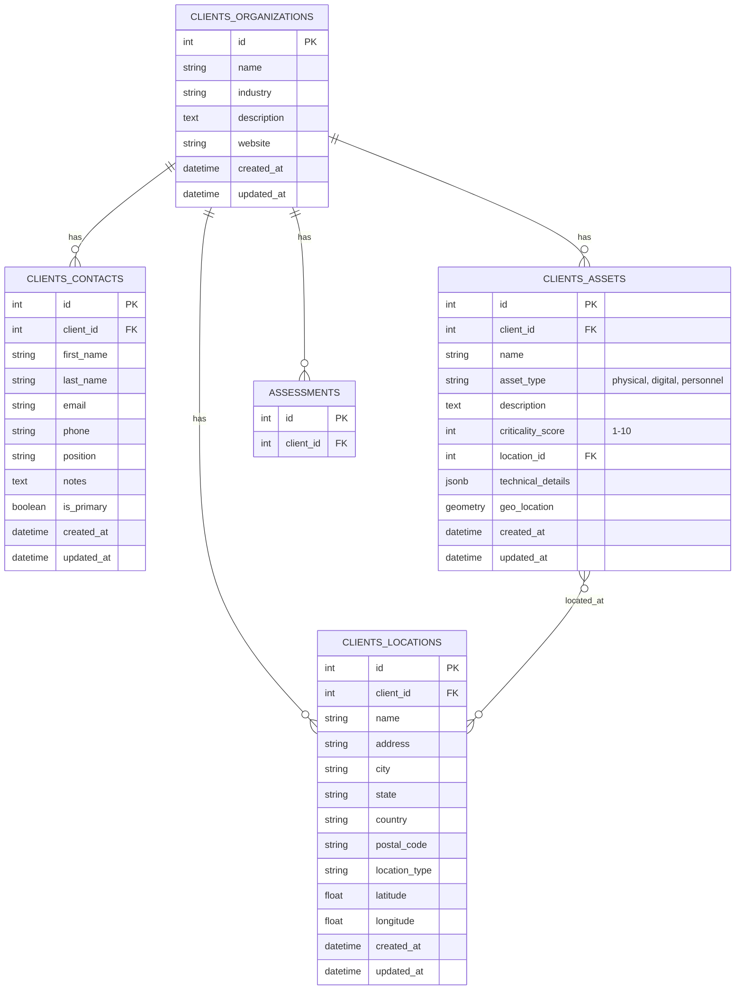

# Phase 2 Integration Plan

Here's the updated plan to integrate Phase 2 (Asset Management), including the addition of latitude and longitude to the `ClientLocation` model:

**1. Database Model Updates (app/models/client.py):**

- **Modify `ClientAsset` model:**
  - Change `asset_type` to: `db.Column(db.String, CheckConstraint("asset_type IN ('physical', 'digital', 'personnel')"))`.
  - Add `geo_location` column: `db.Column(Geometry('POINT', srid=4326))`.
  - Replace `importance` with `criticality_score`: `db.Column(db.Integer, CheckConstraint('criticality_score BETWEEN 1 AND 10'))`.
  - Change `technical_details` to JSONB: `db.Column(db.JSONB)`.
- **Modify `ClientLocation` model:**
  - Add `latitude` column: `db.Column(db.Float)`.
  - Add `longitude` column: `db.Column(db.Float)`.
- **Create Alembic migration:** A migration script will be generated to apply these database schema changes.

**2. API Endpoint Implementation (app/blueprints/client/routes.py):**

- **Add new routes:** Implement the following RESTful endpoints:
  - `GET /assets` (List/search assets)
  - `GET /assets/{id}` (Retrieve single asset)
  - `POST /assets` (Create new asset)
  - `PUT /assets/{id}` (Update asset)
  - `DELETE /assets/{id}` (Delete asset)
  - `GET /assets/analytics` (Asset statistics)
- **Input Validation:** Implement input validation for all endpoints.
- **Security:** Implement role-based access control and audit logging.

**3. Elasticsearch Integration (app/services/elasticsearch/):**

- **Create `asset_service.py`:** A new service file will handle asset-specific Elasticsearch operations.
- **Implement indexing:** Functions will index asset data on create/update/delete.
- **Implement search:** Implement search functionality (text search, geographic queries, filters).

**4. Frontend Components (app/templates/client/):**

- **Create new templates:**
  - Asset listing (with filtering)
  - Asset detail view (with map)
  - Create/edit forms
- **Integrate with API:** Use JavaScript (Fetch API) for API interaction.
- **Map Integration:** Use a mapping library (e.g., Leaflet) for asset location display.

**5. Testing:**

- **Unit tests:** Cover model CRUD, validation, geographic calculations, and logic.
- **Integration tests:** Cover API endpoints, database transactions, Elasticsearch, and authorization.
- **End-to-end tests:** Cover asset creation, search, and visualization.

**6. Conventions:**

- All code will adhere to the project's coding and documentation conventions (`conventions.md`).

**Database Schema Changes (Mermaid Diagram):**

