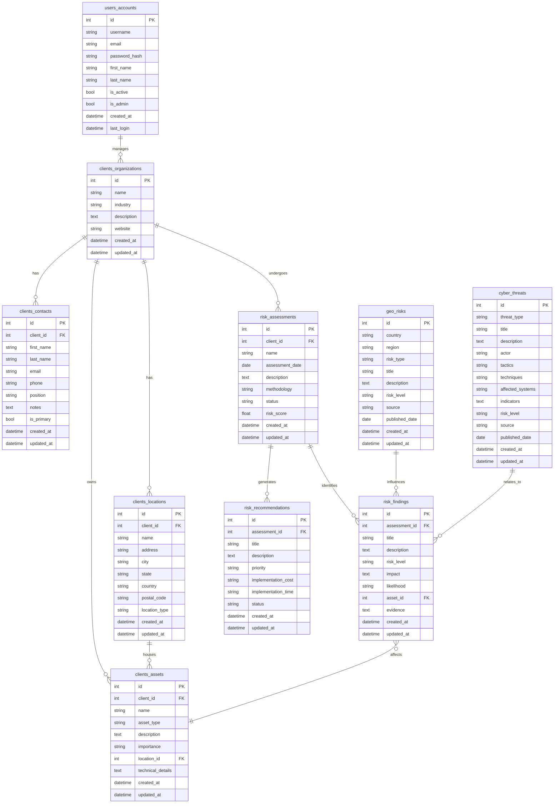

# IronMonkey Risk Research Database Schema

This document outlines the database schema for the IronMonkey Risk Research platform, including table relationships and field descriptions.

## Entity Relationship Diagram

## Table Descriptions

### User Management

#### users_accounts
Stores user authentication and profile information.
- `id`: Primary key
- `username`: Unique username for login
- `email`: User's email address
- `password_hash`: Hashed password
- `first_name`: User's first name
- `last_name`: User's last name
- `is_active`: Whether the account is active
- `is_admin`: Whether the user has admin privileges
- `created_at`: Account creation timestamp
- `last_login`: Last login timestamp

### Client Management

#### clients_organizations
Stores client organization information.
- `id`: Primary key
- `name`: Organization name
- `industry`: Industry sector
- `description`: Organization description
- `website`: Organization website
- `created_at`: Record creation timestamp
- `updated_at`: Record update timestamp

#### clients_locations
Stores physical locations for client organizations.
- `id`: Primary key
- `client_id`: Foreign key to clients_organizations
- `name`: Location name
- `address`: Street address
- `city`: City
- `state`: State/province/region
- `country`: Country
- `postal_code`: Postal/ZIP code
- `location_type`: Type of location (HQ, Branch, etc.)
- `created_at`: Record creation timestamp
- `updated_at`: Record update timestamp

#### clients_contacts
Stores contact information for client personnel.
- `id`: Primary key
- `client_id`: Foreign key to clients_organizations
- `first_name`: Contact's first name
- `last_name`: Contact's last name
- `email`: Contact's email address
- `phone`: Contact's phone number
- `position`: Job title/position
- `notes`: Additional notes
- `is_primary`: Whether this is the primary contact
- `created_at`: Record creation timestamp
- `updated_at`: Record update timestamp

#### clients_assets
Stores client assets subject to risk assessment.
- `id`: Primary key
- `client_id`: Foreign key to clients_organizations
- `name`: Asset name
- `asset_type`: Type of asset (Infrastructure, Application, etc.)
- `description`: Asset description
- `importance`: Importance level (Critical, High, Medium, Low)
- `location_id`: Foreign key to clients_locations
- `technical_details`: Technical details in JSON format
- `created_at`: Record creation timestamp
- `updated_at`: Record update timestamp

### Risk Assessment

#### risk_assessments
Stores risk assessment information.
- `id`: Primary key
- `client_id`: Foreign key to clients_organizations
- `name`: Assessment name
- `assessment_date`: Date of assessment
- `description`: Assessment description
- `methodology`: Assessment methodology
- `status`: Assessment status (draft, in_progress, complete)
- `risk_score`: Overall risk score
- `created_at`: Record creation timestamp
- `updated_at`: Record update timestamp

#### risk_findings
Stores risk findings identified during assessments.
- `id`: Primary key
- `assessment_id`: Foreign key to risk_assessments
- `title`: Finding title
- `description`: Finding description
- `risk_level`: Risk level (Critical, High, Medium, Low)
- `impact`: Impact description
- `likelihood`: Likelihood assessment
- `asset_id`: Foreign key to clients_assets
- `evidence`: Evidence supporting the finding
- `created_at`: Record creation timestamp
- `updated_at`: Record update timestamp

#### risk_recommendations
Stores recommendations for addressing findings.
- `id`: Primary key
- `assessment_id`: Foreign key to risk_assessments
- `title`: Recommendation title
- `description`: Recommendation description
- `priority`: Priority level (Critical, High, Medium, Low)
- `implementation_cost`: Cost assessment (High, Medium, Low)
- `implementation_time`: Time estimate (Short, Medium, Long)
- `status`: Implementation status (open, in_progress, implemented, rejected)
- `created_at`: Record creation timestamp
- `updated_at`: Record update timestamp

### Intelligence

#### geo_risks
Stores geopolitical risk intelligence.
- `id`: Primary key
- `country`: Affected country
- `region`: Affected region
- `risk_type`: Type of risk (political, economic, etc.)
- `title`: Risk title
- `description`: Risk description
- `risk_level`: Risk level (Critical, High, Medium, Low)
- `source`: Intelligence source
- `published_date`: Publication date
- `created_at`: Record creation timestamp
- `updated_at`: Record update timestamp

#### cyber_threats
Stores cyber threat intelligence.
- `id`: Primary key
- `threat_type`: Type of threat (APT, Malware, etc.)
- `title`: Threat title
- `description`: Threat description
- `actor`: Threat actor/group
- `tactics`: MITRE ATT&CK tactics
- `techniques`: MITRE ATT&CK techniques
- `affected_systems`: Systems affected
- `indicators`: Indicators of compromise in JSON format
- `risk_level`: Risk level (Critical, High, Medium, Low)
- `source`: Intelligence source
- `published_date`: Publication date
- `created_at`: Record creation timestamp
- `updated_at`: Record update timestamp

## PostgreSQL Schema Structure

The database uses multiple PostgreSQL schemas to organize tables:

### clients Schema
- `clients.organizations`
- `clients.locations`
- `clients.contacts`
- `clients.assets`
- `clients.relationships`
- `clients.reports`

### users Schema
- `users.accounts`
- `users.roles`
- `users.permissions`
- `users.activity_logs`

### risk Schema
- `risk.assessments`
- `risk.findings`
- `risk.recommendations`
- `risk.geo_risks`
- `risk.cyber_threats`

### app Schema
- `app.settings`
- `app.audit_logs`
- `app.scheduled_tasks`
- `app.notifications`
